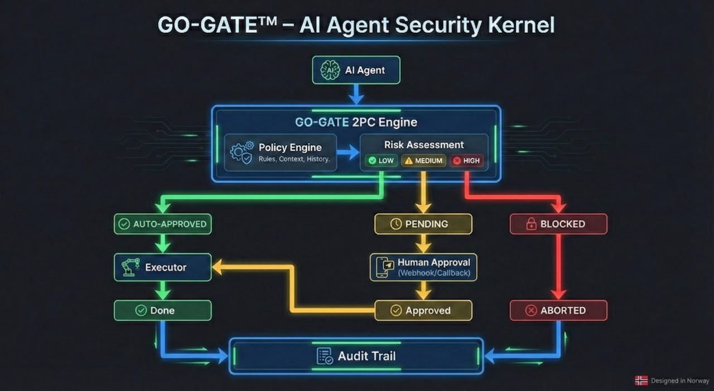

# GO-GATE 🛡️

**Database-Grade Safety for AI Agents**



[English](#english) | [中文](#中文)

---

## English

GO-GATE brings **Two-Phase Commit (2PC)** safety guarantees to AI agent operations. Just as databases ensure transaction integrity, GO-GATE ensures AI agents cannot execute dangerous operations without proper authorization.

### 🎯 Core Philosophy

> "AI agents that act without control are dangerous.  
> AI agents that wait for approval for everything are useless.  
> **There is no middle ground... until now.**"

### ✨ Features

- **Two-Phase Commit Engine** – PREPARE → PENDING → COMMIT/ABORT
- **Risk-Based Policies** – LOW (auto-approve) / MEDIUM (verify) / HIGH (human required)
- **Sandboxed Execution** – No shell=True, path traversal prevention, workspace isolation
- **Immutable Audit Trail** – SQLite WAL with append-only logging
- **Human-in-the-Loop** – Webhook/callback integration for approvals. Build your own approval clients (CLI, GUI, or chat bots) using the flexible callback API.
- **Fail-Closed Security** – Unknown operations require human approval
- **Cross-Platform Paths** – Uses `tempfile.gettempdir()` and `Path` for compatibility

### 💻 Platform Support

| Platform | Status | Notes |
|----------|--------|-------|
| **Linux** | ✅ Primary | Full support, tested on Ubuntu/Debian |
| **macOS** | ✅ Best Effort | Expected to work, POSIX-compatible |
| **Windows** | ⚠️ Experimental | Community support, known limitations with subprocess/permissions |

**v1.0 Focus:** Linux/POSIX-first. Windows support is experimental due to differences in process control, permissions, and service management.

### 🚀 Quick Start

```bash
# Install
pip install go-gate

# Or from source
git clone https://github.com/billyxp74/go-gate.git
cd go-gate
pip install -e .
```

```python
import asyncio
import tempfile
from pathlib import Path
from go_gate import GoGate

async def main():
    # Demo: using tempfile. For production, use a persistent db_path.
    db_path = Path(tempfile.gettempdir()) / 'go-gate' / 'go_gate.db'
    db_path.parent.mkdir(parents=True, exist_ok=True)
    
    gate = GoGate(db_path=str(db_path))
    
    # LOW risk (FILE_WRITE to allowed path) – auto-approved by Policy Engine
    output_path = Path(tempfile.gettempdir()) / 'go-gate-sandbox' / 'output.txt'
    output_path.parent.mkdir(parents=True, exist_ok=True)
    
    result = await gate.execute({
        'op_type': 'FILE_WRITE',
        'target': str(output_path),
        'payload': {'content': 'Hello World'}
        # Note: risk_level is determined internally by Policy Engine
    })
    print(result.status)  # COMMITTED
    
    # HIGH risk – requires human approval
    # Pushing to remote repository
    result = await gate.execute({
        'op_type': 'GIT_PUSH',
        'target': 'origin',  # High risk operation – blocked pending approval!
        'payload': {'branch': 'main'}
    })
    print(result.status)  # PENDING_HUMAN_APPROVAL

asyncio.run(main())
```

### 🏗️ Architecture

```
┌─────────────┐     ┌─────────────┐     ┌─────────────┐
│   Agent     │────▶│  GO-GATE    │────▶│  Human      │
│   Request   │     │  2PC Engine │     │  Approval   │
└─────────────┘     └──────┬──────┘     └─────────────┘
                           │
          ┌────────────────┼────────────────┐
          ▼                ▼                ▼
    ┌─────────┐      ┌─────────┐      ┌─────────┐
    │ Policy  │      │ Sandbox │      │  Audit  │
    │ Engine  │      │Executor │      │  Trail  │
    └─────────┘      └─────────┘      └─────────┘
```

### 📊 Risk Levels

Risk is determined automatically by the Policy Engine based on `op_type` and `target`.

**Note:** Default policies are automatically seeded from Python code (`_init_policies()`) on first startup — no manual configuration required. GO-GATE is plug-and-play.

| Level | Operations | Approval |
|-------|-----------|----------|
| **LOW** | FILE_WRITE (safe paths) | Auto-approve |
| **MEDIUM** | FILE_DELETE, GIT_COMMIT | Verify then approve |
| **HIGH** | SHELL_EXEC, GIT_PUSH | Human required |
| **UNKNOWN** | Any undefined operation | **Human required** (fail-closed) |

### 🛡️ Security Guarantees

1. **Deterministic Policies** – Code, not configuration
2. **Immutable Audit** – Append-only, tamper-evident
3. **Sandboxed Execution** – No shell injection, path traversal blocked
4. **Fail-Closed** – When in doubt, ask human

### 📖 Documentation

- [Architecture](docs/architecture.md)
- [Threat Model](docs/threat_model.md)
- [API Reference](docs/api_reference.md)
- [Deployment Guide](docs/deployment.md)

### 🧪 Testing

```bash
# Install with dev dependencies
pip install ".[dev]"

# Run tests
pytest -q

# Verify installation (use single quotes to avoid bash history expansion)
python -c 'from go_gate.core.go_gate import GoGate; print("GO-GATE ready")'
```

### 🤝 Contributing

We welcome contributions! Please see [CONTRIBUTING.md](CONTRIBUTING.md) for guidelines.

All contributors must sign the [Contributor License Agreement (CLA)](CLA.md).

### 📝 License & Trademarks

Apache 2.0 – See [LICENSE](LICENSE)

**GO-GATE™** is a trademark of William Park. See [TRADEMARKS.md](TRADEMARKS.md) for usage guidelines.

---

## 中文

# GO-GATE 🛡️

**AI代理的数据库级安全保障**


---

### 🎯 核心理念

> "不受控制的AI代理很危险。  
> 事事等待批准的AI代理没用。  
> **以前没有中间地带……直到现在。**"

### ✨ 功能特性

- **两阶段提交引擎** – 准备 → 待定 → 提交/中止
- **基于风险的策略** – 低风险（自动批准）/ 中风险（验证）/ 高风险（需人工）
- **沙盒执行** – 禁止shell=True，防止路径遍历，工作区隔离
- **不可变审计追踪** – SQLite WAL只追加日志
- **人工介入** – Webhook/回调集成用于审批。使用灵活的回调 API 构建您自己的审批客户端（CLI、GUI 或聊天机器人）。
- **故障安全** – 未知操作需人工批准
- **跨平台路径** – 使用 `tempfile.gettempdir()` 和 `Path` 确保兼容性

### 💻 平台支持

| 平台 | 状态 | 说明 |
|------|------|-------|
| **Linux** | ✅ 主要 | 完全支持，在 Ubuntu/Debian 上测试 |
| **macOS** | ✅ 尽力支持 | 预期可用，POSIX 兼容 |
| **Windows** | ⚠️ 实验性 | 社区支持，子进程/权限方面存在已知限制 |

**v1.0 重点：** Linux/POSIX 优先。Windows 支持为实验性，因进程控制、权限和服务管理方面存在差异。

### 🚀 快速开始

```bash
# 安装
pip install go-gate

# 或从源码安装
git clone https://github.com/billyxp74/go-gate.git
cd go-gate
pip install -e .
```

```python
import asyncio
import tempfile
from pathlib import Path
from go_gate import GoGate

async def main():
    # 演示：使用 tempfile。生产环境请使用持久化 db_path。
    db_path = Path(tempfile.gettempdir()) / 'go-gate' / 'go_gate.db'
    db_path.parent.mkdir(parents=True, exist_ok=True)
    
    gate = GoGate(db_path=str(db_path))
    
    # 低风险（FILE_WRITE 到允许路径）– 由策略引擎自动批准
    output_path = Path(tempfile.gettempdir()) / 'go-gate-sandbox' / 'output.txt'
    output_path.parent.mkdir(parents=True, exist_ok=True)
    
    result = await gate.execute({
        'op_type': 'FILE_WRITE',
        'target': str(output_path),
        'payload': {'content': 'Hello World'}
        # 注意：风险等级由策略引擎内部确定
    })
    print(result.status)  # COMMITTED
    
    # 高风险 – 需人工批准
    # 推送到远程仓库
    result = await gate.execute({
        'op_type': 'GIT_PUSH',
        'target': 'origin',  # 高风险操作 – 等待批准！
        'payload': {'branch': 'main'}
    })
    print(result.status)  # PENDING_HUMAN_APPROVAL

asyncio.run(main())
```

### 🏗️ 架构

```
┌─────────────┐     ┌─────────────┐     ┌─────────────┐
│   代理      │────▶│  GO-GATE    │────▶│   人工      │
│   请求      │     │  2PC引擎    │     │   审批      │
└─────────────┘     └──────┬──────┘     └─────────────┘
                           │
          ┌────────────────┼────────────────┐
          ▼                ▼                ▼
    ┌─────────┐      ┌─────────┐      ┌─────────┐
    │ 策略    │      │ 沙盒    │      │ 审计    │
    │ 引擎    │      │执行器   │      │ 追踪    │
    └─────────┘      └─────────┘      └─────────┘
```

### 📊 风险等级

风险由策略引擎根据 `op_type` 和 `target` 自动确定。

**注意：** 默认策略在首次启动时自动从 Python 代码（`_init_policies()`）填充 — 无需手动配置。GO-GATE 开箱即用。

| 等级 | 操作 | 审批 |
|------|------|------|
| **低风险** | 文件写入（安全路径） | 自动批准 |
| **中风险** | 文件删除、Git提交 | 验证后批准 |
| **高风险** | Shell执行、GIT_PUSH | 需人工审批 |
| **未知** | 任何未定义操作 | **需人工审批**（故障安全）|

### 🛡️ 安全保证

1. **确定性策略** – 代码而非配置
2. **不可变审计** – 只追加，防篡改
3. **沙盒执行** – 无shell注入，阻止路径遍历
4. **故障安全** – 有疑问时询问人工

### 📖 文档

- [架构](docs/architecture.md)
- [威胁模型](docs/threat_model.md)
- [API参考](docs/api_reference.md)
- [部署指南](docs/deployment.md)

### 🧪 测试

```bash
# 安装开发依赖
pip install ".[dev]"

# 运行测试
pytest -q

# 验证安装（使用单引号避免 bash 历史扩展）
python -c 'from go_gate.core.go_gate import GoGate; print("GO-GATE ready")'
```

### 🤝 贡献

我们欢迎贡献！请参阅 [CONTRIBUTING.md](CONTRIBUTING.md) 了解指南。

所有贡献者必须签署 [贡献者许可协议（CLA）](CLA.md)。

### 📝 许可证与商标

Apache 2.0 – 参见 [LICENSE](LICENSE)

**GO-GATE™** 是 William Park 的商标。使用指南参见 [TRADEMARKS.md](TRADEMARKS.md)。
